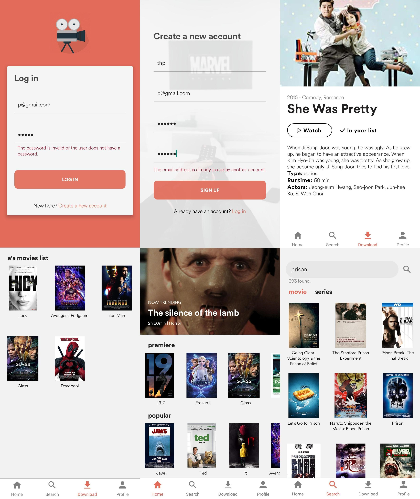

# filmRN
demo film app (React Native)

## Intro
This is one of the first apps I created with React Native. It is a very basic and simple app (for practicing purpose only lol). There would be a lot of bugs and some bad code logic, therefore it would be great if you can give me some feedbacks, so that I can improve my skills. <3

My email: [phuonghata1995@gmail.com]

I use Firebase Auth and Firestore in this project to authenticate user as well as store data. Much thanks to [OMDb API](http://www.omdbapi.com/) for having such a great movie database.


## How to use?
User will have to create an account (email verification is not required). User can search movie/tv show/game/series, check the infos (type, runtime, actors,...) and save the film to their own account.

Here are some setup instruction for anyone who interests.



## Set up 

After clone this projeect and put it in a file name *AwesomeProject*, please follow these steps 

### 1. Create Firebase app
Really simple. You need a google account to create a project.
After go to the main page of Firebase, click *Go to console* -> *create a new app* then follow the instruction (just google if you stuck somewhere). After create the app, choose the circle Android or IOS. Then follow the instruction again.

=> Output: Basically you have to download a "key", which names *google-services.json* for Android and *GoogleService-Info.plist* for IOS file. Add this file to the folder as the instruction (again) below:

+ Please read[add Firebase to Android project](https://firebase.google.com/docs/android/setup?hl=vi). 
+ Please read [Add Firebase to IOS project](https://firebase.google.com/docs/ios/setup?hl=vi).

(P/s: I have already set up the firebase project for Android. You can check the SDK again and update to the latest, if there are no major changes between the version in the project and the latest version)

**Please notice that I also use "react-native-firebase" to connect Firebase to React Native code.**

### 2. Create database and enable Firebase Auth
+ Choose Firebase Authetication and turn it on, choose **Sign up with email/password**
+ Choose Database, switch to **Cloud Firestore** and create a collection **users**

### 3. Set up the emulator/physical device
+ I know you can do this step by yourself!!!

### 4. Run the project 

For Android: 

```
cd AwesomeProject
npm install
npm react-native run-android
```

For IOS: 

### And that's it!! The app will run!

If there any problems, please reach out to me [phuonghata1995@gmail.com]

## Thank you for visiting
My name is Phuong Ta, a newbie coder coming from Vietnam, started coding in July 2019. I'm currently looking for the chance to improve my skills as well as get more experience working on real projects.


